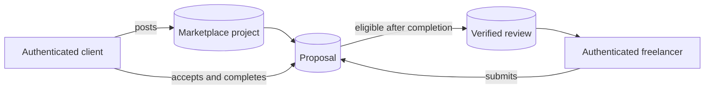

# Project Rely

> **A full-stack freelancing marketplace for clear briefs, capable specialists, and accountable collaboration.**

## Live links

| Destination | Link | Purpose |
| --- | --- | --- |
| Public source repository | [github.com/anon-443/project-rely](https://github.com/anon-443/project-rely) | Source code, documentation, and GitHub Actions history |
| GitHub Pages portfolio demo | [anon-443.github.io/project-rely](https://anon-443.github.io/project-rely/) | Public static showcase of the visual product experience |
| Full application | [orbitfolio-fbbkuhat.manus.space](https://orbitfolio-fbbkuhat.manus.space) | Server-backed marketplace with OAuth, database, and role-aware workspaces |

## Overview

Project Rely is a portfolio-grade marketplace application inspired by real freelance workflows. It helps clients post detailed work opportunities and manage incoming proposals, while freelancers can discover live briefs, submit thoughtful proposals, maintain portfolio evidence, and earn verified feedback only after completed engagements.

The product uses the **Atelier Ledger / Night Ledger** visual system: editorial typography, clear operational states, responsive layouts, and restrained interaction design.


## Completed features

| Area | Implemented capability |
| --- | --- |
| Marketplace discovery | Searchable project briefs, category and budget filters, specialist skill and experience filtering, saved briefs, and responsive discovery views |
| Client workflow | Multi-step posting with validation, AI-assisted brief writing, database-backed project publishing, incoming proposal review, acceptance, completion, and verified-review submission |
| Freelancer workflow | Protected freelancer workspace, live open-project discovery, persistent proposal submission/history, portfolio workbench, AI skill suggestions, and verified-review visibility |
| Trust model | Reviews cannot be seeded or fabricated; a client can submit one verified review only after completing an accepted marketplace engagement |
| Communication | Conversation mockup, typing state, read receipts, attachment preview for selected files, notifications, and preference controls |
| Roles and security | OAuth authentication, first-login client/freelancer role choice, protected routes, server-enforced procedures, and denied-role states |
| Preferences | Persistent dark mode, saved briefs, notification preferences, and dashboard sidebar state through browser storage |
| Responsive design | Purposeful desktop, tablet, and mobile layouts verified across marketplace and protected workspace routes |

## Technology

| Layer | Tools |
| --- | --- |
| Frontend | React 19, TypeScript, Vite, Wouter, Framer Motion, Recharts |
| UI | Tailwind CSS 4, shadcn/ui, Lucide icons, custom responsive CSS |
| Backend | Express, tRPC, Zod, server-side AI helpers |
| Data and auth | Drizzle ORM, MySQL/TiDB, OAuth sessions, protected role-aware procedures |
| Quality | Vitest, TypeScript checks, managed production build, GitHub Pages build |

## Persistent marketplace model



Client accounts can manage only their own projects and proposals. Freelancer accounts can propose only to open projects they do not own. A verified review requires the project owner, an accepted proposal, and a completed engagement.

## Run locally

### Prerequisites

- Node.js 22+
- pnpm 10+
- A MySQL-compatible database
- OAuth and server-side environment configuration for the full application

### Commands

```bash
pnpm install
pnpm dev
pnpm check
pnpm test
pnpm build
pnpm github-pages:build
```

Do not commit `.env` files, database URLs, OAuth secrets, API keys, session cookies, or personal access tokens.

### Database setup

The managed deployment already provides the required database and OAuth configuration. For a local full-stack run, add your own environment values outside version control, then generate and apply the schema migration:

```bash
pnpm drizzle-kit generate
pnpm db:push
```

The marketplace schema includes user roles plus persistent `marketplace_projects`, `marketplace_proposals`, and `marketplace_reviews` records.

## Deployment

### GitHub Pages demo

1. Open [https://anon-443.github.io/project-rely/](https://anon-443.github.io/project-rely/).
2. If the link was just updated, wait briefly for the **Deploy GitHub Pages** workflow on the repository’s **Actions** tab to finish.
3. Use this link for LinkedIn, portfolio sharing, and reviewers who need a public visual demo.

GitHub Pages hosts the static portfolio presentation. It cannot run OAuth, server AI, or the MySQL-backed project/proposal/review flows.

### Full application

Use [the managed full application](https://orbitfolio-fbbkuhat.manus.space) for role-based login, persistent marketplace records, and verified reviews. **Vercel is not required** for this project: the managed deployment already hosts the Node server and database-connected functionality.

See the repository’s [final deployment checklist](docs/FINAL_DEPLOYMENT_CHECKLIST.md) for the handoff steps.

## Account roles

| Role | Access |
| --- | --- |
| Client | Post persistent briefs, review proposals, accept work, complete engagements, submit verified reviews |
| Freelancer | Browse live briefs, submit proposals, track submissions, manage portfolio evidence, view verified reviews |
| Administrator | Separate protected administration state; not implicitly granted client or freelancer actions |

## Portfolio review guide

Start with the **GitHub Pages demo** to evaluate visual design and responsiveness. Then open the **full application** to assess OAuth, role-aware client/freelancer workspaces, and database-backed marketplace workflows. The source code is organized so reviewers can trace the persistent model through `drizzle/schema.ts`, `server/db.ts`, `server/routers.ts`, and the protected workspace pages.

## Project structure

```text
client/src/         React pages, components, responsive UI, and browser preferences
server/             tRPC procedures, authorization rules, and database helpers
drizzle/             MySQL schema and migrations
docs/                deployment, design, and validation documentation
.github/workflows/  GitHub Pages deployment workflow
```

---

Built as a portfolio project demonstrating product design, responsive frontend engineering, secure role-aware full-stack development, and practical marketplace workflows.
