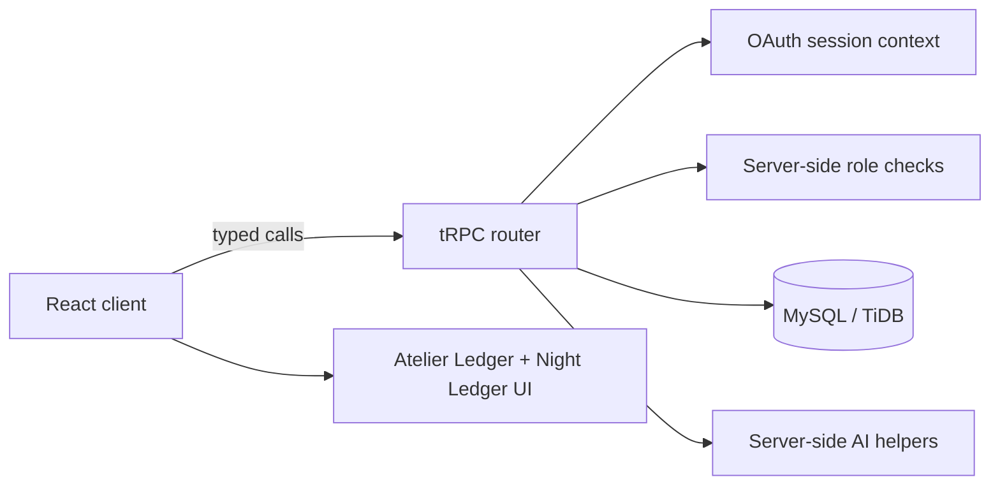

# Project Relay

> **A full-stack freelance marketplace concept for thoughtful teams and independent specialists.**

Project Relay is a portfolio-grade web application that turns freelance discovery into a structured, credible workflow. Clients can publish detailed briefs, manage proposal activity, and communicate with specialists. Freelancers can curate portfolio evidence, receive AI-assisted skill suggestions, track work performance, and manage their professional presence through an editorial interface.

## Why this project

Most freelance marketplaces prioritize volume over decision quality. Project Relay explores a more deliberate product model: briefs carry clear scope and constraints, proposals live beside context, and freelancer evidence is structured as a dossier rather than a generic profile card.

The application was designed and built to demonstrate product thinking, responsive frontend engineering, server-side AI integration, role-aware access control, and a considered visual system.

## Highlights

| Product area | Included capability |
| --- | --- |
| Marketplace discovery | Searchable project briefs, specialist profiles, portfolio filtering, sorting, saved briefs, and shareable dossier URLs. |
| Client workflow | Multi-step project posting with validation, AI-assisted brief writing, preview, and submission feedback. |
| Freelancer workflow | Drag-and-drop portfolio workbench, local file previews, AI skill suggestions, performance metrics, proposals, and active-project ledgers. |
| Communication | Attachment previews, typing feedback, read receipts, message notifications, and notification preferences. |
| Account security | OAuth sessions, first-login role selection, server-enforced client/freelancer workspaces, protected procedures, and denied-role states. |
| Design system | Responsive **Atelier Ledger** interface, persistent **Night Ledger** dark mode, accessible controls, and reduced-motion support. |

## Technology

| Layer | Tools |
| --- | --- |
| Frontend | React 19, TypeScript, Vite, Wouter, Framer Motion, Recharts |
| UI foundation | Tailwind CSS, shadcn/ui, Lucide icons, custom responsive CSS |
| Backend | Express, tRPC, Zod, server-side built-in LLM integration |
| Data and auth | Drizzle ORM, MySQL/TiDB, OAuth sessions, role-aware procedures |
| Quality | Vitest, TypeScript checking, production build validation |

## Architecture



## Key technical decisions

**Server-side role enforcement.** A new authenticated account begins as an unassigned user and is directed to choose either a client or freelancer role. Role-sensitive workspaces use protected server procedures; the browser only reflects permission decisions made on the server.

**AI without browser secrets.** AI-assisted project descriptions and skill tags are generated through server-side procedures, which keeps provider credentials out of the client bundle.

**Shareable portfolio evidence.** Portfolio filter and sort settings are encoded in the URL, allowing a client to share a specific curated view of a freelancer dossier.

**Honest feedback design.** The profile supports a verified-review framework but contains no fabricated reviews, ratings, or testimonials.

## Local development

### Prerequisites

- Node.js 22+
- pnpm 10+
- A MySQL-compatible database for persistence
- OAuth and server-side AI environment configuration from your chosen hosting platform

### Run locally

```bash
pnpm install
pnpm dev
```

### Quality checks

```bash
pnpm check     # TypeScript validation
pnpm test      # Unit tests
pnpm build     # Production client and server build
```

> Do not commit `.env` files, database URLs, OAuth secrets, API keys, session cookies, or personal access tokens. Configure secrets in your deployment platform or GitHub repository settings instead.

## Project structure

```text
client/
  src/pages/         Product routes: marketplace, dossier, workbench, dashboard, settings
  src/components/    Shared controls: notifications, chat, theme, account access
  src/lib/           Tested client-side state and formatting helpers
server/
  routers.ts         Typed tRPC contracts and protected role procedures
  db.ts              Database helpers
  *_*.ts             AI helpers and role access logic
drizzle/             Schema definitions and migrations
docs/                Domain and GitHub handoff notes
```

## Account roles

| Role | Protected access |
| --- | --- |
| Client | Client workspace, project posting, proposal review |
| Freelancer | Portfolio workbench, freelancer dashboard, opportunity workflow |
| Administrator | Separate protected administrative state; no client or freelancer workspace is assumed |

## Deployment notes

This repository is a **full-stack** application. It needs hosting that supports a Node server, OAuth callbacks, database connectivity, and server-side AI requests. A static host such as GitHub Pages can present a static showcase, but it cannot run the complete application unchanged.

For a branded production URL, bind a custom domain through the hosting provider’s domain panel after registering the domain. See [the custom domain and GitHub handoff guide](docs/CUSTOM_DOMAIN_AND_GITHUB.md) for the DNS checklist.

## Exporting to GitHub

1. In the project management area, open **Settings → GitHub**.
2. Select your GitHub account or organization, then enter a repository name such as `project-relay-marketplace`.
3. Export the repository and set it to **Public** if it is intended for portfolio review.
4. In GitHub, add this repository description:

   > Full-stack freelance marketplace with AI-assisted briefs, secure role-aware onboarding, and responsive freelancer tooling.

5. Add topics such as `react`, `typescript`, `trpc`, `marketplace`, `freelance`, `ai`, `oauth`, and `portfolio`.
6. Add two to four screenshots: marketplace discovery, project posting, freelancer dossier/workbench, and Night Ledger dashboard.

## Portfolio talking points

When presenting the project, lead with the product problem and then the engineering decisions:

- I designed a focused freelance marketplace that prioritizes brief clarity and portfolio evidence.
- I implemented protected client and freelancer role flows with server-side authorization checks.
- I integrated server-side AI assistance for project briefs and skill-tag suggestions.
- I built responsive discovery, communication, analytics, portfolio-management, and dark-mode experiences.

## Documentation

- [Custom domain and GitHub handoff](docs/CUSTOM_DOMAIN_AND_GITHUB.md)

---

Built as a portfolio project to demonstrate end-to-end product design and full-stack TypeScript development.
